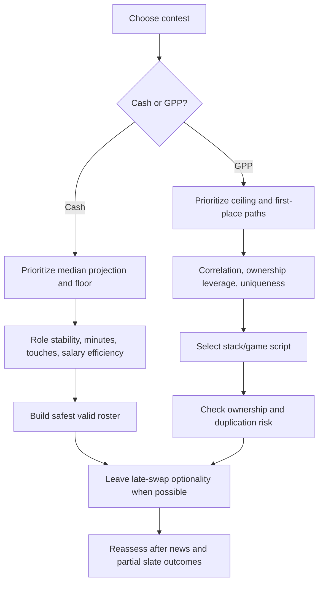
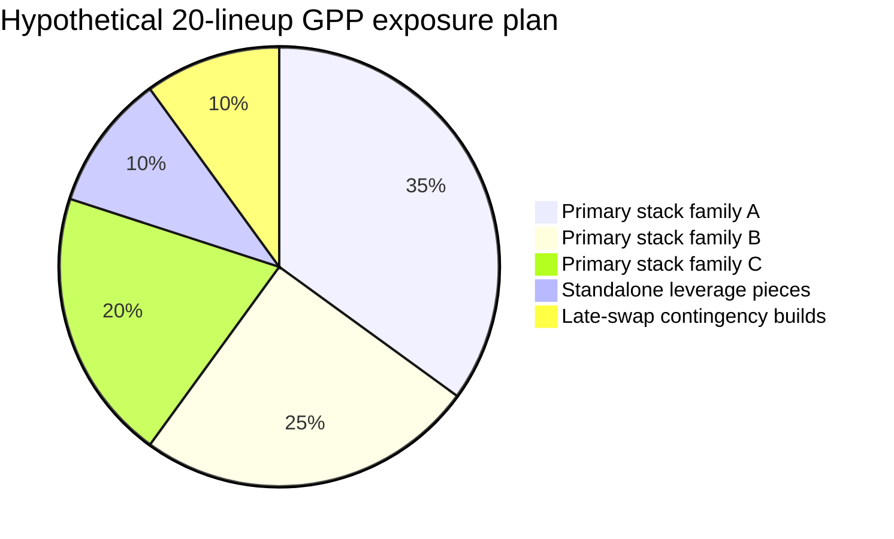
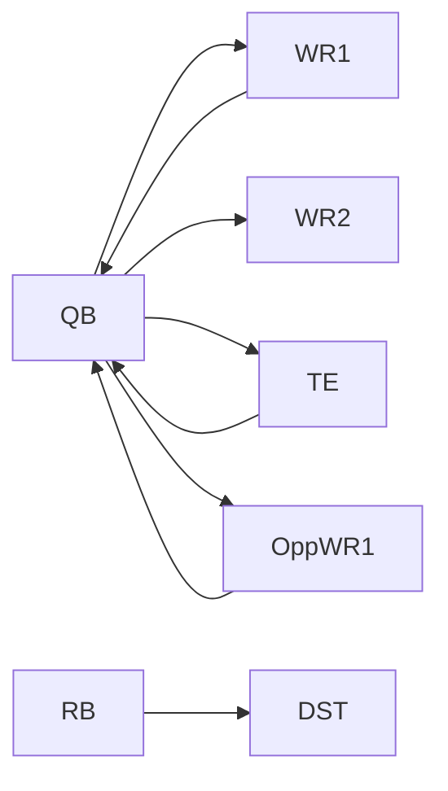
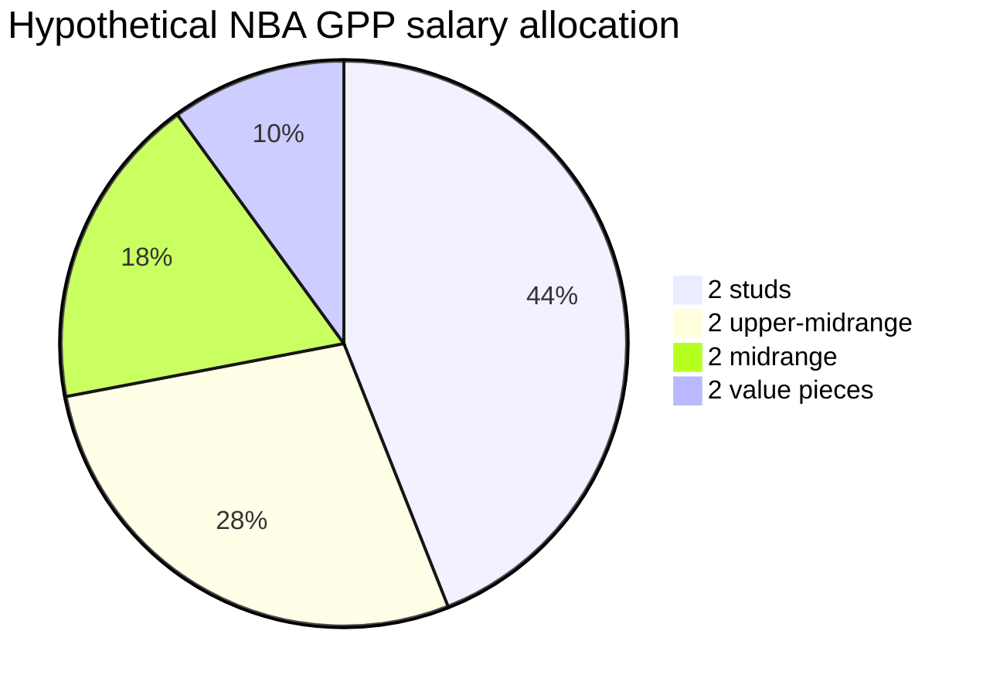

# DFS Lineup Construction Research Report

## Executive Summary

Daily fantasy sports lineup construction is not mainly a player-picking problem; it is a contest-optimization problem. The strongest academic work on DFS shows that the correct objective changes with payout structure: in cash-style contests you are maximizing the probability of clearing a cutoff, while in top-heavy tournaments you are optimizing for outcomes that can beat the field at the very top, which makes opponent behavior, lineup variance, and correlation structurally important. Older optimization work in top-heavy DFS similarly frames portfolio building as maximizing the chance that at least one entry wins, subject to variance and inter-lineup correlation constraints, while newer contest-simulation approaches emphasize that a lineup’s value is contest-specific rather than absolute. citeturn23view0turn26search1turn21view6turn17search0

Across the four sports in scope, stacking is strongest in MLB, next strongest in NFL, more conditional in EPL, and weakest in NBA. MLB hitters produce directly for one another through runs, RBIs, lineup turn, and bullpen exposure, making same-team stacks foundational in tournaments. NFL has strong event-level correlation around QB-pass-catcher TD chains and useful opponent “bring-back” relationships. EPL correlation depends heavily on scoring rules: set pieces, crossing, clean sheets, and defensive actions can create moderate same-team or game-environment correlations. NBA is different: teammate scoring is bounded by finite possessions and minutes, so the edge usually comes from projections, minutes, usage concentration, and late swap more than from brute-force stacking, though ownership-aware same-team pairings still matter in GPPs. citeturn21view1turn28view0turn28view1turn21view2turn21view3turn20view2

The most robust way to identify playable pieces is to combine raw projection, ceiling distribution, projected ownership, role and usage, injury/news sensitivity, and environment variables such as weather, park factors, pace, and clean-sheet or scoring environment. Official league/stat sources support this workflow: the NBA defines usage rate as the percentage of team plays used by a player while on the floor; the NBA and NFL publish formal injury reporting; MLB’s Statcast ecosystem publishes park factors and weather-based ball-flight effects; and the Premier League publishes xG and injury information. Those inputs should be filtered differently by contest type: floor and salary efficiency dominate cash, while ceiling, correlation, ownership gaps, and duplication control dominate GPPs. citeturn16search0turn10search1turn10search0turn32view1turn32view2turn16search2turn10search3turn17search0

Examples below use common salary-cap slates, with roster illustrations anchored to officially published sport pages from urlDraftKingsturn41view0 and late-swap/team-limit rules from urlFanDuelturn19view0. Those pages explicitly describe a nine-player NFL lineup, an eight-player NBA lineup, a ten-player MLB lineup built around two pitchers and eight batters, and an eight-player soccer lineup, while late swap and same-team limits vary by site and contest. citeturn41view0turn41view1turn4view2turn4view3turn19view0

## Analytic Objective and Contest Theory

The cleanest way to think about DFS is that each lineup is a probabilistic bet on a game script plus a probabilistic bet against the field. The Haugh-Singal framework models double-ups and top-heavy tournaments differently because they are different mathematical problems, not merely different levels of risk. Hunter-Vielma-Zaman reach the same practical conclusion from a different angle: in top-heavy contests, the right portfolio is not just the one with the highest mean projection, but one with sufficient variance and low enough inter-lineup correlation to give at least one entry a realistic path to the very top. Newer simulation-based contest tools operationalize this by evaluating win rate, cash rate, and ROI against realistic opponent fields and exact payout structures. citeturn23view0turn26search1turn21view6

| Contest type | Primary objective | What matters most | What usually hurts |
|---|---|---|---|
| Cash games | Beat the median or payout cutoff | Raw projection, stable role, minutes/touches, salary efficiency, minimized zero risk | Over-stacking, excessive leverage, unnecessary low-owned darts |
| Small-field GPP / single-entry | Beat a smaller field with some uniqueness | Strong projection plus modest correlation and selective leverage | Cash-style lineups with no path to first |
| Large-field GPP / MME | Maximize right-tail outcomes and first-place probability | Correlation, ceiling, ownership arbitrage, duplication control, portfolio diversification | Purely median-optimized lineups, fragile overconcentration, duplicated chalk builds |

The table above is directly supported by the academic DFS optimization literature and by current simulation-based lineup evaluation guidance. citeturn23view0turn26search1turn21view6turn17search0

That flow is a synthesis of the cited theory and practice sources: contest type determines the optimization target, which then determines how much weight to place on projection, correlation, ownership, and late-slate optionality. citeturn23view0turn26search1turn21view6turn21view7

## Core Lineup-Construction Methods

The core DFS methods all matter, but they matter for different reasons. Stacking forces positive correlation into a lineup, which is essential when one real-world outcome can unlock multiple fantasy events. Leverage is the ownership-adjusted value of a play or lineup: not simply “low-owned,” but under-rostered relative to its chance of helping win the contest. Contrarian plays are useful only when they preserve enough projection or ceiling to remain viable. Value targeting matters because salary efficiency opens roster construction and makes premium ceilings affordable, but value without role certainty is usually fake value. Diversification matters in MME because top-heavy contests reward first place while punishing fragile portfolios that are too concentrated in one assumption set. Late swap matters because classic DFS is dynamic until each individual game locks, and field behavior changes as early outcomes and late news hit. citeturn21view1turn21view4turn21view5turn21view6turn21view7turn22view4turn40view0

| Method | Operational use | Best fit | Failure mode |
|---|---|---|---|
| Stacking | Pair positively correlated players or teams | GPPs, especially NFL and MLB | Using stacks mechanically in cash or in low-correlation contexts |
| Leverage | Overweight under-rostered upside, underweight over-owned fragility | All tournaments | Confusing “low-owned” with “good” |
| Contrarian pivots | Replace duplicative chalk with similar-ceiling alternatives | Small- and large-field GPPs | Making too many thin pivots at once |
| Value targeting | Buy points, minutes, touches, or role at a discount | All formats | Chasing cheap price tags without role certainty |
| Diversification | Spread across multiple plausible game scripts | MME | Diversifying so widely that true edge is diluted |
| Bankroll and entry allocation | Control variance and survive downswings | All formats | Treating every slate as an all-in event |
| Late swap | Rebuild around new information and early-slate outcomes | Sports with late news, especially NBA | Locking in dead assumptions after slate start |

The cited practice literature is especially consistent on diversification and late swap: lineups should be different enough to cover multiple valid game scripts, but not so different that lineup quality collapses. citeturn40view0turn21view7turn22view3

A practical bankroll rule set, drawn from current practitioner guidance rather than universal theorem, is conservative and explicit. Risking roughly 2.5%–5% of bankroll on a main slate or day is a common recommendation, with even lower effective risk for GPP-heavy or high-variance sports. Older training materials also converge around “do not exceed 5%–10% in action on a slate” and around an 80/20 cash-to-GPP starting framework for players who are not pure tournament specialists, while noting that highly volatile sports such as MLB and NFL should often push players toward safer contest mixes or smaller overall bankroll exposure. citeturn39view0turn39view1turn39view2turn39view3

Classic DFS generally does **not** allow true in-game substitution after a player’s game has started. In practice, “in-game adjustment” means adjusting the still-unlocked part of your portfolio after early games begin, using late swap to react to late scratches, starting-lineup changes, ownership revelations, weather postponement risk, and the need either to protect a strong early result or to increase variance if your early rosters are behind. FanDuel’s published rules explicitly distinguish slates with and without late swap and state that in late-swap contests players remain editable until their respective game start times; current late-swap guidance further emphasizes protecting against zeroes and re-optimizing the remaining portfolio as the slate story changes. citeturn19view0turn21view7turn31view1

That chart is illustrative, but the portfolio logic follows the cited diversification guidance: concentrate enough to preserve edge, yet spread enough to cover materially different game scripts and reduce fragility. citeturn40view0turn21view6

## Projection-Based Player Identification

A projection process is useful only if it separates **median output**, **ceiling probability**, and **field behavior**. Point projections tell you how often a player is expected to score well; ownership projections tell you how often the field is expected to roster that player; contest value emerges from the interaction of the two, filtered through payout structure. That logic is explicit in current projection and contest-simulation documentation and is entirely consistent with the academic top-heavy literature. citeturn21view5turn21view6turn23view0turn26search1

Official metrics matter because they anchor role and environment. The NBA’s usage percentage is the share of team plays a player uses while on the floor, which makes it one of the best direct role indicators in projection work. MLB’s Statcast suite provides hard-hit, barrel, and park-factor context, while the league’s weather-integrated analysis shows wind materially changes batted-ball outcomes. The Premier League publishes official xG and stat definitions, which makes finishing volume and chance quality quantifiable. The NFL’s Next Gen Stats platform provides route, passing, and receiving context that improves matchup interpretation beyond box-score volume. citeturn16search0turn16search5turn32view1turn32view2turn16search2turn16search10turn16search3

| Filter | What to measure | Cash interpretation | GPP interpretation |
|---|---|---|---|
| Projection differential | Your projection versus market/consensus baseline | Prefer positive gaps with stable role | Prefer positive gaps that the field is underpricing |
| Ownership projection | Expected roster rate in your contest type | Often follow strong chalk when it is clearly optimal | Fade or underweight chalk that is priced to perfection |
| Usage / role | Usage, touches, routes, minutes, lineup spot | Seek stability and locked workload | Seek role expansion before field fully catches up |
| Matchup metrics | Pace, pass funnel, target matchup, park factor, xG environment | Use to break projection ties | Use to find under-owned ceiling pockets |
| Weather / venue | Wind, precipitation, dome/outdoor, park effects | Avoid avoidable zeroes and postponements | Attack extreme environments the field underreacts to |
| Injuries / team news | Official designations, starters, absences | Late value is often mandatory | Late role changes are the biggest source of leverage |
| Salary efficiency | Projected points per dollar | Core roster-building variable | Important, but ceiling and ownership can override it |
| Ceiling vs. floor | Range of outcomes | Floor dominates | Ceiling dominates, especially if ownership is modest |

The table above synthesizes official metric definitions, official injury reporting, and DFS projection/ownership guidance. citeturn16search0turn10search1turn10search0turn32view1turn32view2turn16search2turn10search3turn21view5turn21view6

A useful **practitioner** screen, clearly as an inference rather than a standard industry formula, is to track four quantities for every player:  
**Point-per-dollar** = projection / salary-in-thousands;  
**Ceiling premium** = ceiling projection minus median projection;  
**Ownership gap** = your estimate of “winning-lineup frequency” minus projected ownership;  
**Leverage proxy** = ceiling projection × (1 − ownership).  
These are not official metrics, but they are aligned with the cited research showing that lineup quality depends jointly on expected production, range of outcomes, contest structure, and opponent behavior. citeturn21view5turn21view6turn23view0turn26search1

The single most important operational principle is news discipline. Official NBA injury reports are time-structured and update throughout the day; the NFL publishes official weekly statuses; the Premier League publishes club-by-club injury news; and MLB weather/park context can shift materially close to first pitch. If your process does not update projections as those inputs change, your “best plays” are stale before lock. citeturn10search1turn10search0turn10search3turn32view2turn21view7

## NFL Implementation

NFL is the clearest case for deliberate tournament correlation. Historical FanDuel research on breakout-game relationships shows that when a team’s QB1 hits a strong “big game,” the same team’s WR1, TE1, and WR2 see materially elevated hit rates, and the opponent’s WR1 and QB1 also rise. Optimizer and strategy guides therefore treat QB-centered stacking and opponent bring-backs as core GPP structure rather than stylistic preference. Academic DFS work supports the same broad logic by rewarding lineup variance and right-tail outcomes in top-heavy contests. citeturn28view0turn28view1turn23view0turn26search1

| Stack type | When it is strongest | Counter-stack / bring-back | Typical size | Cash vs. GPP |
|---|---|---|---|---|
| QB + WR1 | High-total or concentrated target tree | Opposing WR1 | 2-man core | Fine in cash, strong in GPP |
| QB + WR/TE | Red-zone-heavy usage or narrow pass-game concentration | Opposing WR1 or pass-catching RB | 2-man core | Better for GPP than cash |
| QB + WR + WR/TE | Shootouts, narrow tree, aggressive pass rate | One opposing skill player | 3- to 4-man primary stack | Standard large-field GPP |
| QB + 2 pass catchers + bring-back | Fast game, close spread, condensed offenses | Alpha opponent receiver / TE | 4-man structure | Best in tournaments |
| RB + DST | Run-favorite, sack/turnover script, home favorite | Opposing volume WR if projecting comeback garbage time | 2-man mini-stack | More useful in small-field and cash-adjacent builds |
| Whole-team onslaught | Extreme team-total outlier or very large-field GPP | Optional single opponent pass-catcher | 4 to 5 correlated spots | Strictly GPP and mostly huge field |

The table reflects official contest constraints plus published NFL correlation studies and tournament strategy guidance. citeturn19view0turn28view0turn28view1turn28view2turn22view4

That relationship map matches the cited NFL correlation evidence: QB pass-catcher links are strongest, opponent bring-backs often improve game-environment capture, and RB-DST is a separate game-script correlation. citeturn28view0turn28view1

**Projection-based heuristics.** In NFL cash, the priority order is usually volume certainty first, salary efficiency second, and correlation third. In GPPs, first ask whether the game environment can plausibly support an outlier score, then whether the target tree is concentrated enough for stacking to matter, then whether projected ownership is high enough that you need a differentiator inside the stack. High winds or severe weather can downgrade passing efficiency and kicking enough to push you away from fragile aerial stacks, while injuries can redistribute touches and target share so dramatically that backup salaries become false “musts” for the field and true leverage points for you. citeturn12search1turn12search2turn10search0turn36search2turn22view3

**Sample lineup templates.**  
A DraftKings-style large-field template is: **QB / RB / RB / WR / WR / WR / TE / FLEX / DST**, where the structure is either **QB + 2 pass catchers + 1 bring-back + 5 independent pieces** or **RB + DST mini-stack + skinny QB stack elsewhere**. A cash-style template is usually the opposite: the best projected QB, the safest touch RBs, a target-dominant WR core, and minimal unnecessary correlation. citeturn41view0turn17search0turn22view4

**Hypothetical case study.**  
Suppose a quarterback projects for **24.0** fantasy points at **11%** ownership. His WR1 projects for **19.2** at **18%**, his TE for **13.1** at **9%**, and the opposing WR1 for **18.0** at **12%**. The obvious chalk alternative is a standalone RB at **22.5** points and **35%** ownership. In cash, the RB can still be correct because median points and field-optimality matter. In a large-field GPP, the four-man correlated stack can be superior because one real-world shootout creates multiple scoring channels at once, while the ownership product is still manageable. That is exactly the kind of lineup structure the cited NFL correlation work favors.

A final NFL note: underdog WRs remain viable even in losing scripts because trailing teams throw more, so a bring-back does not need to be a favorite-side player. The cleanest GPP process is to think in stories: **favorite steamroll**, **back-and-forth shootout**, or **unexpected underdog push**, and then build the stack that best monopolizes that story. citeturn37search2turn28view0turn28view1

## NBA Implementation

NBA lineup construction is more projection-driven and news-driven than stack-driven. Official injury reporting is highly structured, teams must report statuses on tight deadlines, and late lineup changes can radically alter minutes and usage. Practitioner late-swap guidance treats NBA as a sport where projections must keep updating after lock for all still-unlocked games, because starting-lineup news and late scratches can instantly reprice large parts of the slate. citeturn10search1turn15search1turn31view1turn21view7

The correlation structure is also different. Historical NBA strategy work argues that teammate correlations are weaker than in NFL because possessions and fantasy events are finite, yet tournament value can still emerge from contrarian lineup construction, especially when same-team star combinations are individually popular but jointly rare. That is why NBA GPPs often reward **mini game stacks**, **same-team star plus injury beneficiary**, and **late-swap leverage**, but rarely reward blind four-player same-team onslaughts on full slates. citeturn21view2turn28view2turn31view0

| Stack type | Best use case | Counter / game-back | Typical size | Preferred format |
|---|---|---|---|---|
| 1v1 high-total mini-stack | Close game with two alpha usage hubs | Opposing star or center | 2 players | Small-field or large-field GPP |
| 2v1 game stack | Tight spread, concentrated rotations | One opposing alpha | 3 players | GPP |
| Same-team star + value beneficiary | Teammate injury concentrates usage and minutes | Opposing primary scorer | 2 players | Cash and GPP |
| Same-team double-star | Ownership product is lower than field expects | None or single opponent run-back | 2 players | Contrarian GPP |
| Late-swap conditional pair | News breaks after initial lock | Remaining-game leverage pivot | 2 to 3 players | NBA-specific GPP edge |

The structural point is supported by the cited NBA correlation and late-swap sources. citeturn21view2turn31view1turn15search1

**Projection-based heuristics.** The first screen in NBA should be minutes, role, and on/off usage. The NBA officially defines usage percentage as the percentage of team plays used by a player while on the floor, so when a major starter sits, the correct process is to reproject both minutes and usage redistribution rather than simply “plugging in” the backup. Per-minute production matters, but a per-minute monster without a secure role is weaker than a stable 34-minute starter at a modest per-minute rate in cash; in GPPs, the highest-value plays are often the ones whose new role has not yet been fully reflected in ownership. citeturn16search0turn10search1turn29search8turn29search10

Historical contest-dashboard study also shows NBA pricing is tighter than NFL pricing: more than 61% of winning lineups in the examined DraftKings sample used the full salary cap, 86.25% used at least $49,900, and the average winner used $49,923. That does **not** mean spending all salary is mandatory on every slate, but it does mean NBA often punishes intentional salary left over more than NFL does. citeturn31view0

This hypothetical allocation reflects the empirical reality that NBA slates often reward efficient use of the cap plus late-breaking value, not large chunks of unused salary. citeturn31view0turn10search1

**Sample lineup templates.**  
A DraftKings-style template is **PG / SG / SF / PF / C / G / F / UTIL**. In cash, the build is generally **one or two elite raw-point anchors + near-lock injury value + stable midrange minutes**. In GPPs, the highest-EV template is often **one game mini-stack + one same-team usage pair + one low-owned ceiling forward/center from a late game** so that late swap remains live. citeturn41view1turn31view1turn21view2

**Hypothetical case study.**  
Assume a star PG projects for **57** points at **34%** ownership. A cheap replacement SG is now starting because of injury and projects for **32** points at **60%** ownership across **31** minutes. A contrarian PF on the same team projects for **42** points at **9%** ownership because his on/off rate jumps from **1.00** to **1.28** fantasy points per minute without the injured starter. The opponent’s center projects for **45** at **12%** ownership in a game with a tight spread. In cash, the SG value is likely unavoidable. In GPPs, pairing the PG with the contrarian PF and opposing C can outperform a pure-chalk build because it captures concentrated usage plus game competitiveness while avoiding a duplicated “best values only” lineup.

The operational edge in NBA is simple but ruthless: react faster than the field to role changes, then use late swap to decide whether to protect a good early start with strong median plays or to chase with lower-owned ceiling pieces if your early lineups disappoint. citeturn15search1turn21view7turn31view1

## MLB Implementation

MLB is the purest stacking sport in DFS. Published strategy primers repeatedly make the same point: hitters on the same team are positively correlated because one successful plate appearance creates more opportunities for the hitters behind him, and team outlier performances compound through runs, RBIs, lineup turnover, and weaker opposing bullpen usage. That is why large-field MLB tournaments are built around stack architecture first and individual hitters second. citeturn21view1turn37search3

| Stack type | Use case | Counter-stack / secondary stack | Typical size | Preferred format |
|---|---|---|---|---|
| 5-3 | Strong primary offense plus concentrated secondary offense | Another full mini-stack from a separate team | 8 hitters across two teams | Large-field GPP |
| 5-2-1 | Premium five-man stack plus cheap secondary mini-stack | One one-off ceiling bat | 5 + 2 + 1 | Large-field GPP |
| 4-4 | Two strong offenses in high-total environments | Full game or double-primary story | 8 hitters | GPP, especially balanced slates |
| 4-3-1 | Salary-balanced version of primary-plus-secondary build | One high-ceiling one-off | 7 correlated hitters | Small-/mid-field GPP |
| 3-man secondary stack | Salary relief or complement to expensive primary stack | Pair with 4- or 5-man main stack | 3 hitters | All tournament types |

The stack sizes above align with published MLB stacking primers and official site-level team restrictions. citeturn21view1turn19view0

**Projection-based heuristics.** The most reliable stack filters are still lineup slot, opposing pitcher weakness, park factor, and weather. MLB’s Statcast park factors explicitly quantify how a venue influences events such as home runs, runs, hits, and strikeouts relative to average. MLB’s own weather-integrated research shows wind can materially move batted balls, while historical DFS weather analysis finds hitters benefit from stronger winds and especially from winds blowing out, with pitchers performing better in opposite conditions. Said differently: if your model treats Coors, a wind-out Wrigley game, and a neutral dome as equivalent environments, your player pool is wrong before salary enters the picture. citeturn32view1turn32view2turn32view3

Cash games in MLB are the place where pitcher projection dominates more than hitter stacks. Longstanding cash strategy guidance emphasizes that pitchers are more predictable than hitters and that cash rosters should start with safe high-upside arms before worrying about bats. Tournament builds reverse that emphasis: you still need viable pitching, but the path to a true first-place lineup is usually a stack capturing an offense’s ceiling game. citeturn17search4turn21view1

**Sample lineup templates.**  
A common DraftKings-style template is **SP / SP / C / 1B / 2B / 3B / SS / OF / OF / OF**. In cash, the template is often **best raw projection pitcher + best value pitcher + value bats in good lineup spots**. In GPPs, a classic chassis is **5-man primary stack + 3-man secondary stack + one or two pitchers who fit the salary/ownership profile of the stack build**. citeturn4view2turn21view1turn17search4

**Hypothetical case study.**  
Suppose Team A’s top five hitters project for **12.5, 11.8, 10.9, 10.4, and 9.7** points against a fly-ball pitcher in a park with a **120+ HR factor** and **14 mph wind out**. Team B’s secondary three-man mini-stack projects for **10.2, 8.9, and 8.4** in another above-average run environment. A chalk offense projects similarly, but its five-man stack is **30%** owned versus Team A at **14%**. In cash, the chalk may be fine if its cheapest pieces are also the best point-per-dollar bats. In a large-field GPP, Team A plus Team B is stronger because the primary stack has comparable expected output with a better ownership profile, and the stacked scoring process magnifies that leverage if Team A posts a crooked number early.

One subtle but important point: game stacks in MLB are viable, but not automatic. Opposing mini-stacks are strongest when both pitchers are attackable, bullpens are weak, and weather/park conditions boost both sides. What is usually **not** viable is playing hitters directly against your own cash-game pitcher, because that creates self-canceling lineups with low median outcomes. citeturn21view1turn32view1turn32view3

## EPL Implementation

EPL DFS sits between projection play and correlation play, and everything depends on scoring. On DraftKings-style soccer scoring, set-piece takers generate stable fantasy floors through crosses and chances created, which is why they are the backbone of cash builds. On FanDuel-style scoring, clean-sheet bonuses and defensive actions materially increase the value of goalkeepers, active full-backs, center-backs under pressure, and defenders who also take set pieces. The official FanDuel rules make those scoring pathways explicit, and current soccer DFS guides treat them as format-defining. citeturn20view2turn21view3turn33search0turn38search1

| Stack type | Why it works | Counter-stack / leverage against it | Typical size | Preferred format |
|---|---|---|---|---|
| GK + DEF/full-back | Shared clean-sheet outcome; defender may also add crosses or tackles | Opposing high-shot striker or winger | 2 players | Cash and small-field |
| Set-piece MID + striker/CB target | Assists, corners, chances created, headed-goal paths | Opposing save-heavy GK in large-field leverage builds | 2 players | GPP and cash if roles are certain |
| Favorite full-back/winger + striker | Crossing/assist channel plus goal equity | Opposing defender volume if expecting different match flow | 2 players | GPP |
| Small game stack from high-xG match | Capture goals from both sides in open games | None or one-off clean-sheet fade | 2 to 3 players | GPP |
| Underdog save GK + volume defender | Defensive-stat floor plus save chance | Opposing central striker can be used as leverage | 2 players | Small-field and salary relief |

The logic of these stacks comes from official scoring definitions plus contemporary soccer DFS strategy writing. citeturn20view2turn21view3turn33search0turn38search1

**Projection-based heuristics.** Start with confirmed XI certainty, then identify set-piece share, crossing role, xG/xA or chance-creation profile, clean-sheet probability, and defensive-action floor. The Premier League’s official stats center publishes xG and related definitions, while official injury pages help clarify whether roles are likely to change. In cash, a midfielder taking eight to ten corners can outscore a pure striker with better goal odds because repeated crossing volume is bankable. In tournaments, goal-dependent forwards matter more, but they should usually be paired with the creator who feeds them or used as leverage against an over-owned crossing chalk piece. citeturn16search2turn16search10turn10search3turn21view3turn33search0

Because projected roles can change right before kickoff, EPL is also a sport where late confirmation matters. If your platform permits late swap, the same within-slate logic applies as elsewhere: react to confirmed lineups, remove dead plays, and re-evaluate whether you need floor or volatility from later matches. Official rules and current late-swap guidance support that approach. citeturn19view0turn21view7

**Sample lineup templates.**  
An eight-man salary-cap template can be framed as **GK + 2 DEF + 2 MID + 2 FWD + UTIL** in general construction terms. A cash-style build is usually **clean-sheet-favored GK + attacking DEF/full-back + primary set-piece MID + secondary crosser + salary-efficient forward with 90-minute floor**. A tournament-style build is more often **set-piece creator + same-team finisher + one clean-sheet or defensive-action mini-stack + a low-owned goal-threat one-off from another match**. citeturn20view2turn21view3

**Hypothetical case study.**  
Imagine a set-piece midfielder projects for a median **13.5** points at **22%** ownership because he averages nine corners/crosses in favored matches. His team’s striker projects for **14.2** at **12%** ownership, the attacking full-back for **10.8** at **8%**, and the goalkeeper for **11.0** at **18%** because of strong win and clean-sheet equity. The slate’s highest-owned pure goalscorer projects for **16.5** but owns only a thin floor and carries **38%** ownership. In cash, the midfielder and goalkeeper are often the better foundation. In GPPs, the best version is frequently **MID + striker** or **GK + full-back**, not all four pieces together, unless the slate is tiny and you need to embrace a single dominant favorite.

The most common soccer mistake is to import NFL/MLB stacking instincts too aggressively. EPL correlation exists, but it is more scoring-channel-specific: clean sheet, crossing-to-goal, set-piece-to-header, or open-game shot volume. Build around those actual channels, not just around team logos. citeturn20view2turn21view3turn33search0

**Open questions and limitations.** This report emphasizes high-confidence, cross-source conclusions and uses hypothetical examples for lineup templates and cases. Exact optimal stack sizes, ownership thresholds, and salary-allocation rules vary materially by site scoring, roster positions, late-swap policy, slate size, contest size, and payout shape; those values are not universal constants. Because no single contest format was specified, the illustrations use common salary-cap templates and should be adapted to the exact rules and scoring of the contest being entered.